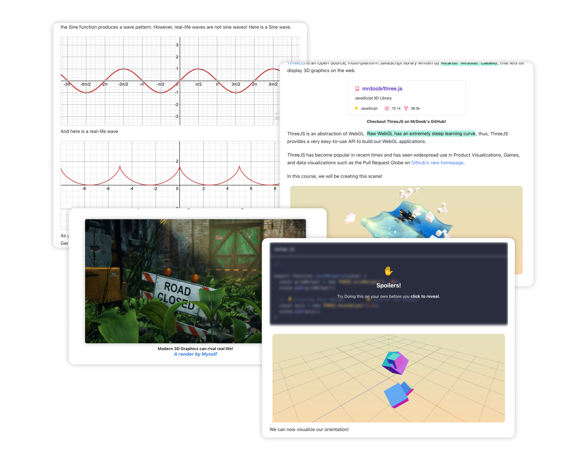

 

  <h1 align="center">MDX-Components</h1>
  
  

    A Collection of MDX Components.
     
    <a href="https://github.com/FarazzShaikh/mdx-components/issues/new">Report Bug</a>
    ·
    <a href="https://farazzshaikh.github.io/mdx-components/">API Docs</a>
  

  

    
  

  

    My work is for and funded by the community. If you used this or found this helpful consider supporting me.
  

  

    
    
    
     
  

 

    </img>

 

